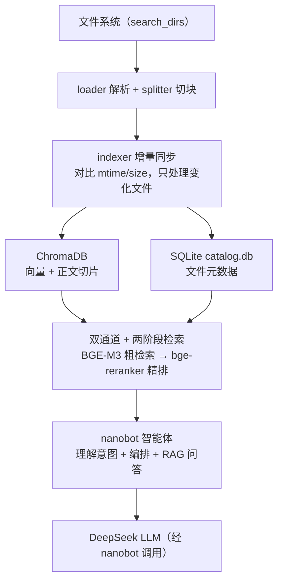

# AI 本地资料智能检索

一个基于 **BGE 系列模型**的本地资料检索命令行工具，面向个人本地文件（PDF / Word / 文本 / Markdown / HTML）提供：

- **双通道检索**：按文件名定位 + 按内容语义检索
- **两阶段精排**：BGE-M3 向量粗检索 → bge-reranker 交叉编码精排
- **增量索引**：只对新增/修改的文件重新向量化
- **智能体入口**：由 **nanobot** 负责理解意图、编排工具与 RAG 问答（DeepSeek）

数据全程保存在本地，检索无需联网；问答与工具编排由 nanobot 完成（nanobot 调用 DeepSeek）。

---

## 系统架构



### 存储分层

| 存储 | 引擎 | 存什么 | 用途 |
|---|---|---|---|
| `db/chroma.sqlite3` | ChromaDB | 正文切片的向量 + 原文 + `source/page/chunk_index` | 语义检索 |
| `db/catalog.db` | SQLite | 文件元数据（路径/名称/格式/大小/修改时间） | 按名字/格式/文件夹定位文件 |
| `db/.index_state.json` | JSON | 每个文件的 `mtime/size/chunk_ids` 账本 | 增量索引（判断哪些文件变了） |

> 三者职责分离：换 embedding 模型只需重建 ChromaDB，文件清单（catalog）和账本不受影响。

---

## 技术栈

- **向量化**：`sentence-transformers` + `BAAI/bge-m3`
- **重排序**：`BAAI/bge-reranker-v2-m3`（CrossEncoder）
- **向量库**：`chromadb`（PersistentClient，本地持久化）
- **元数据库**：SQLite（标准库 `sqlite3`）
- **文件解析**：`pdfplumber`（PDF）、`python-docx`（Word）、内置文本读取
- **CLI**：标准库 `argparse`，统一输出 JSON
- **智能体 / LLM**：`nanobot`（HKUDS 个人 AI 助手，配 DeepSeek `deepseek-v4-pro`）

> 本项目 CLI 本身是**纯确定性后端**（检索/解析/入库），不调用任何 LLM；问答与工具编排全部交给 nanobot。

---

## 目录结构

```
project/
├── cli.py                 # 命令行入口（11 个子命令，纯确定性检索）
├── config.json            # 运行配置（搜索目录、切块、模型、top_k 等）
├── .env.example           # 环境变量样例（DeepSeek Key 供 nanobot 用、HF 镜像）
├── requirements.txt       # 依赖清单
├── nanobot/               # nanobot 接入（SKILL.md + setup.py + 配置示例）
├── tools/                 # 核心模块
│   ├── config.py          #   配置读取与合并
│   ├── loader.py          #   文件解析（pdf/docx/txt/md/html）
│   ├── splitter.py        #   文本切块
│   ├── embeddings.py      #   BGE-M3 向量化
│   ├── indexer.py         #   增量索引同步
│   ├── retriever.py       #   检索 + 两阶段精排
│   ├── reranker.py        #   bge-reranker 交叉编码
│   ├── finder.py          #   文件名模糊检索
│   ├── catalog.py         #   元数据库（build/query/stats）
│   └── manage.py          #   库管理（list/remove/stats）
├── tests/                 # pytest 单元测试
├── db/                    # 运行时生成（向量库 + 元数据库 + 账本）
└── data/                  # 本地资料（默认不入库，见 .gitignore）
```

---

## 快速开始

### 1. 环境要求

- Python 3.11+
- 首次使用需联网下载模型（BGE-M3 与 bge-reranker-v2-m3，各约 2GB）

### 2. 安装依赖

```bash
pip install -r requirements.txt
```

### 3. 准备模型

代码以 `local_files_only=True` 加载模型，因此**需要先把两个模型下载到本地缓存**：

- `BAAI/bge-m3`
- `BAAI/bge-reranker-v2-m3`

国内网络可在 `.env` 里配置 HuggingFace 镜像端点 `HF_ENDPOINT` 后再下载。

### 4. 配置环境变量

复制 `.env.example` 为 `.env`（`DEEPSEEK_API_KEY` 供 nanobot 使用，`HF_ENDPOINT` 供下载模型）：

```bash
cp .env.example .env
```

```dotenv
DEEPSEEK_API_KEY=sk-xxxx
HF_ENDPOINT=https://hf-mirror.com
```

### 5. 配置搜索目录

编辑 `config.json` 的 `storage.search_dirs`，指向你的资料目录：

```json
{
  "storage": {
    "search_dirs": ["F:/资料"],
    "extensions": [".pdf", ".docx", ".txt", ".md", ".html"],
    "max_file_size_mb": 50
  }
}
```

### 6. 导入资料并检索

```bash
# 导入某个文件或目录
python cli.py ingest "F:/资料/会议记录"

# 按内容语义检索
python cli.py search "网络安全应急响应流程"
```

---

## 通过 nanobot 使用（智能体入口）

本项目把 **nanobot**（HKUDS 开源个人 AI 助手）作为「统一交互入口 + Skill 编排层」，采用 **nanobot + SKILL.md + Python Script/CLI** 的轻量集成：nanobot 负责理解用户意图、按 SKILL.md 调用 `cli.py` 子命令，并基于检索结果组织问答；确定性处理仍由 CLI 完成（不为此额外开发 MCP Server）。

### 一键接入

在项目根目录执行：

```bash
python nanobot/setup.py
```

脚本会依次：① 把 `nanobot-ai` 装到独立虚拟环境 `nanobot/.venv`（不污染项目依赖）；② 生成 `~/.nanobot/config.json`（默认模型 DeepSeek）；③ 把 `nanobot/skills/local-doc-retrieval` 安装到 `~/.nanobot/workspace/skills/`，并把 SKILL.md 里的 `{{PROJECT_DIR}}` / `{{PYTHON}}` 替换成实际绝对路径。

可选参数：

| 参数 | 作用 |
|---|---|
| `--python PATH` | 指定运行 `cli.py` 的 Python（默认用项目 `.venv`） |
| `--no-install` | 跳过安装 nanobot（只做配置 + 装 Skill） |
| `--api-key KEY` | 直接传 DeepSeek API Key（默认从项目 `.env` 或环境变量读取） |
| `--index-url URL` | pip 安装源（默认清华镜像） |

### 启动对话

```bash
# 交互式对话
nanobot/.venv/Scripts/nanobot.exe agent

# 单轮自然语言提问
nanobot/.venv/Scripts/nanobot.exe agent -m "帮我找关于注意力机制的资料"

# WebUI
nanobot/.venv/Scripts/nanobot.exe webui
```

之后直接用自然语言即可：nanobot 读到 `local-doc-retrieval` Skill 后，会把「找文件 / 查内容 / 提问 / 管理资料库」等意图路由到 `python cli.py <命令> --json`；对于「提问」，它会先 `search` 拿片段，再自己组织带来源的答案。

### 目录说明

```
nanobot/
├── skills/local-doc-retrieval/SKILL.md   # nanobot 格式的 Skill（name/description + 命令路由 + RAG 指引）
├── config.example.json                   # nanobot 配置示例（DeepSeek 兼容接口）
└── setup.py                              # 一键接入脚本
```

> **两个 Skill 的对应关系**：`skills/本地资料检索/SKILL.md` 给 Claude Code 用；`nanobot/skills/local-doc-retrieval/SKILL.md` 给 nanobot 用（nanobot 要求 `name` 为 ascii 小写+连字符，故目录名用 `local-doc-retrieval`）。两者描述同一套 `cli.py` 命令，共享同一个确定性后端。
>
> **配置说明**：`nanobot/config.example.json` 是 DeepSeek 配置示例。nanobot 具体 config schema 可能随版本略有差异，如生成后 nanobot 报配置错误，可先运行 `nanobot onboard` 生成一份标准配置，再把 `providers.deepseek` 与 `agents.defaults.model` 合并进去。

---

## 命令用法

统一入口：`python cli.py <命令> [参数...]`，输出格式为带缩进的 JSON。

| 命令 | 参数 | 说明 |
|---|---|---|
| `ingest` | `<路径>` | 导入一个文件或目录，建立/更新索引 |
| `find` | `<关键词>` `[--dir]` | 按文件名模糊匹配（子串 + 容错错别字） |
| `search` | `<问句>` `[--top-k]` `[--dir]` | 按内容语义检索 top-k 片段（自动先同步索引） |
| `read` | `<路径>` | 读取指定文件的完整内容 |
| `catalog` | `[--dir]` | 建立/更新元数据库（文件清单） |
| `cquery` | `[--name] [--ext] [--folder]` | 查询元数据库定位文件 |
| `cstats` | 无 | 元数据库统计（文件总数 + 各格式数量） |
| `list` | 无 | 列出索引中的文件 |
| `remove` | `<文件名>` `--yes` | 从索引/向量库删除该文件（**不删磁盘文件**，需 `--yes` 确认） |
| `stats` | 无 | 索引统计（文件数 / 块数 / 总大小） |
| `sync` | 无 | 扫描搜索目录，同步新增/修改/删除的文件（`search` 会自动调用） |

> `search` 执行前会自动同步索引，无需手动 `ingest`。

### 示例

```bash
python cli.py find 会议纪要                          # 找文件名含"会议纪要"的文件
python cli.py search "输液反应怎么处理" --top-k 5     # 语义检索
python cli.py cquery --ext .pdf                     # 列出所有 PDF
python cli.py read "F:/资料/报告.pdf"                # 读文件内容
```

---

## 检索原理

### 双通道检索

| 通道 | 实现 | 适用场景 |
|---|---|---|
| 文件名定位 | `finder.py`（实时遍历）+ `catalog.py`（SQLite） | "有没有叫 xxx 的文件"、"这个文件夹里有哪些 PDF" |
| 内容语义 | `retriever.py`（ChromaDB 向量相似度） | "找出和某个主题相关的片段" |

### 两阶段精排

1. **粗检索**：问句经 BGE-M3 向量化，在 ChromaDB 中召回 `candidate_k=20` 个候选切片。
2. **精排**：候选切片交给 bge-reranker-v2-m3 交叉编码，按相关性重排取 `top_k`。

交叉编码器（CrossEncoder）把「问句 + 候选」成对送入模型，比纯向量相似度更精细，能显著提升排序质量。

### RAG 问答（由 nanobot 完成）

```
用户提问 → nanobot 调 search 检索 top-k 片段 → nanobot 依据片段组织答案 → 返回答案 + 来源
```

CLI 只负责「检索」这一步；「生成答案」由 nanobot 根据 `search` 返回的片段完成（详见 `nanobot/skills/local-doc-retrieval/SKILL.md` 的「基于资料回答」一节）。

---

## 配置说明（config.json）

| 字段 | 默认 | 说明 |
|---|---|---|
| `storage.search_dirs` | `["data"]` | 要索引的目录 |
| `storage.exclude_dirs` | `.venv` `.git` 等 | 扫描时跳过的目录 |
| `storage.exclude_files` | `.env` `*.key` 等 | 扫描/检索时跳过的文件名（支持 glob） |
| `storage.extensions` | `.pdf .docx .txt .md .html` | 支持的格式 |
| `storage.max_file_size_mb` | `50` | 跳过超过该大小的文件 |
| `indexing.chunk_size` / `chunk_overlap` | `500` / `50` | 切块大小与重叠 |
| `indexing.embedding_model` | `BAAI/bge-m3` | 向量模型 |
| `retrieval.top_k` | `5` | 默认返回条数 |
| `retrieval.reranker_model` | `BAAI/bge-reranker-v2-m3` | 重排模型 |

---

## 注意事项

- **敏感数据不入库**：`.env`（含 API Key）和 `data/`（本地资料）均在 `.gitignore` 中排除，且 `.env` 等文件名默认被 `exclude_files` 跳过索引，请勿将含个人隐私的原始文件提交到仓库。
- **换模型需重建索引**：更换 `embedding_model` 后必须删除 `db/` 重新索引，代码会检测模型不一致并报错。
- **`remove` 不删磁盘文件**：它只从向量库和索引账本中移除，不会动磁盘上的原始文件。
- **模型加载为本地模式**：代码使用 `local_files_only=True`，需先手动下载模型到 HuggingFace 缓存。
- **问答需 nanobot**：本项目 CLI 不内置 LLM，RAG 问答请通过 nanobot（`nanobot/.venv/Scripts/nanobot.exe agent`）完成。

---

## 运行测试

```bash
pytest
```

测试覆盖配置读取、文本切块、文件解析、文件名检索、库管理与空库边界情况。
